# User Manual — Spiritual Questionnaire

Практическая инструкция для пользователей приложения по ролям **Студент**, **Куратор**, **Администратор**.

Приложение работает полностью в браузере. Все данные хранятся локально — для переноса между устройствами используйте экспорт/импорт backup-файла.

## Содержание

- [Общие правила](#общие-правила)
- [Студент](#студент)
  - [1. Регистрация и вход](#1-регистрация-и-вход-stu-01)
  - [2. Восстановление профиля](#2-восстановление-профиля-stu-02)
  - [3. Настройка профиля](#3-настройка-профиля-stu-03)
  - [4. Выбор опросника и старт](#4-выбор-опросника-и-старт-stu-04)
  - [5. Прохождение вопроса](#5-прохождение-вопроса-stu-05)
  - [6. Пауза и продолжение](#6-пауза-и-продолжение-stu-06)
  - [7. Завершение опроса и история](#7-завершение-опроса-и-история-stu-07)
  - [8. Экспорт результатов](#8-экспорт-результатов-куратору-stu-08)
  - [9. Импорт и обратная связь](#9-импорт-проверенных-результатов-и-обратная-связь-stu-09)
  - [10. Доработка ответов](#10-доработка-ответов-после-обратной-связи-stu-10)
  - [11. Статистика и аналитика](#11-статистика-и-аналитика-stu-11)
  - [12. Печать и PDF](#12-подготовка-документа-для-печатиpdf-stu-12)
  - [13. Сохранение профиля](#13-сохранение-профиля-для-переноса-stu-13)
- [Куратор](#куратор)
  - [1. Переключение в режим куратора](#1-переключение-в-режим-куратора-cur-01)
  - [2. Загрузка ответов студентов](#2-загрузка-ответов-студентов-cur-02)
  - [3. Проверка и обратная связь](#3-проверка-ответов-и-обратная-связь-cur-03)
  - [4. Статусы review](#4-статусы-review-и-их-значения-cur-04)
  - [5. Экспорт студенту](#5-экспорт-результатов-студенту-cur-05)
- [Администратор](#администратор)
  - [1. Переключение в режим админа](#1-переключение-в-режим-админа-adm-01)
  - [2. Редактирование опросников](#2-редактирование-локальных-опросников-adm-02)
  - [3. Переводы](#3-редактирование-и-добавление-переводов-adm-03)
  - [4. Миграции и сверка](#4-операции-миграции-и-сверки-adm-04)
- [Справочные материалы](#справочные-материалы)

---

## Общие правила

| Ширина экрана | Режим |
|---|---|
| < 768px | Мобильный (компактная раскладка) |
| 768–1023px | Desktop с плотной раскладкой |
| >= 1024px | Полный desktop |

- Все данные хранятся **локально в браузере** (localStorage).
- Для переноса данных между устройствами используйте **backup JSON**.
- Приложение поддерживает **три роли**: студент, куратор, администратор. Переключение между ролями доступно в профиле.
- Поддерживается **смена языка** (русский/английский) и **темы** (светлая/тёмная) без перезагрузки.

---

## Студент

### 1. Регистрация и вход (STU-01)

**Цель:** начать работу новым пользователем.

**Шаги:**

1. Откройте главную страницу `/`.
2. Выберите роль **Студент** из карточек ролей.
3. Введите имя (минимум 2 символа).
4. Нажмите **Продолжить**.

**Важно:**
- Пустое имя или имя короче 2 символов блокирует продолжение с сообщением об ошибке.
- Выбранная роль сохраняется после перезагрузки страницы.
- На мобильных устройствах карточки ролей и поле имени доступны без горизонтального скролла.

**Скриншоты:** 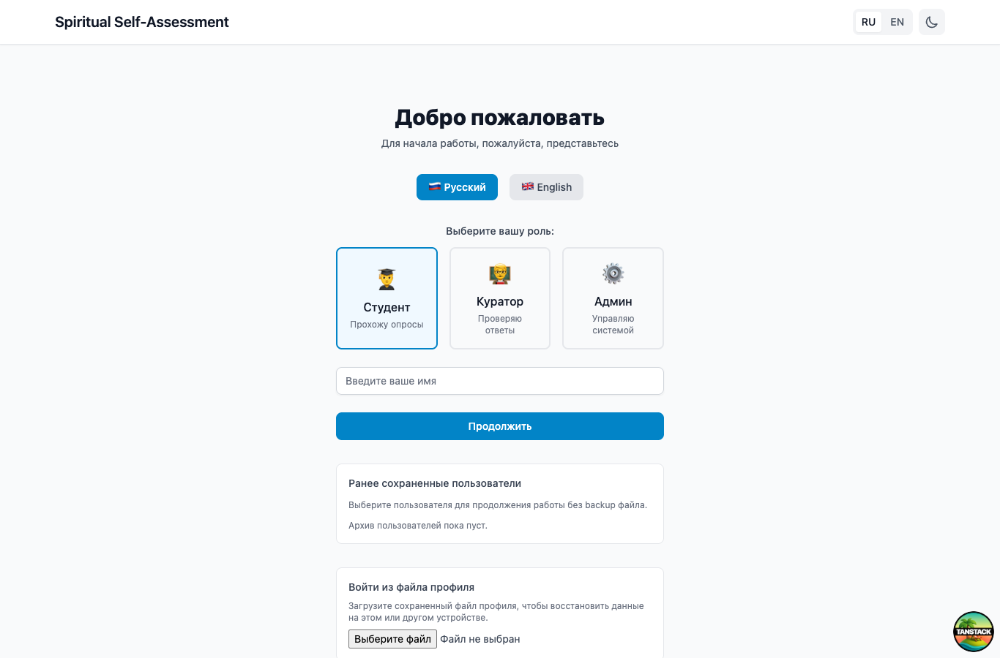 | 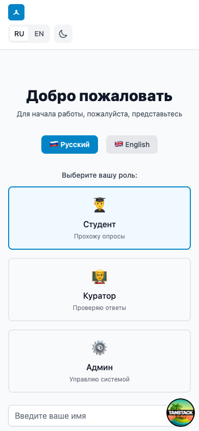

---

### 2. Восстановление профиля (STU-02)

**Цель:** восстановить рабочее состояние после выхода или на другом устройстве.

**Шаги:**

1. На экране входа выберите пользователя из блока **Ранее сохраненные пользователи** (если ранее выходили с сохранением).
2. Либо загрузите backup JSON в блоке **Войти из файла профиля**.

**Что восстанавливается:**
- Профиль (имя, роль, язык, тема).
- Сессии и результаты (студент и куратор).
- Локальные опросники.

**Важно:**
- Ошибочный файл показывает читаемое сообщение об ошибке, данные не повреждаются.

**Скриншоты:**  | 

---

### 3. Настройка профиля (STU-03)

**Цель:** изменить имя, язык, тему и роль.

**Шаги:**

1. Откройте страницу **Профиль и настройки** (`/profile`) через меню пользователя в шапке.
2. Измените **имя** и нажмите **Сохранить имя**.
3. Выберите **язык интерфейса** (русский/английский) — применяется мгновенно без перезагрузки.
4. Выберите **тему** (светлая/тёмная) — влияет на все экраны, но не на печатные отчёты.
5. При необходимости **переключите роль** — переход в соответствующий кабинет.

**Скриншоты:**  | 

---

### 4. Выбор опросника и старт (STU-04)

**Цель:** начать новое прохождение или продолжить приостановленную сессию.

**Шаги:**

1. В блоке **Папки опросников** при необходимости создайте новую папку или подпапку.
2. Переместите опросник в нужную папку (селектор **Переместить в** на карточке).
3. Нажмите **Начать опрос** (или **Продолжить**, если опрос на паузе).

**Важно:**
- Локальные опросники помечаются бейджем **(локальный)**.
- Если опрос был на паузе, старт возобновляет сохранённую сессию с нужного вопроса.
- При недоступности сервера статических опросников показывается fallback-уведомление.
- Структура student-папок сохраняется локально и восстанавливается после перезагрузки.

**Скриншоты:** 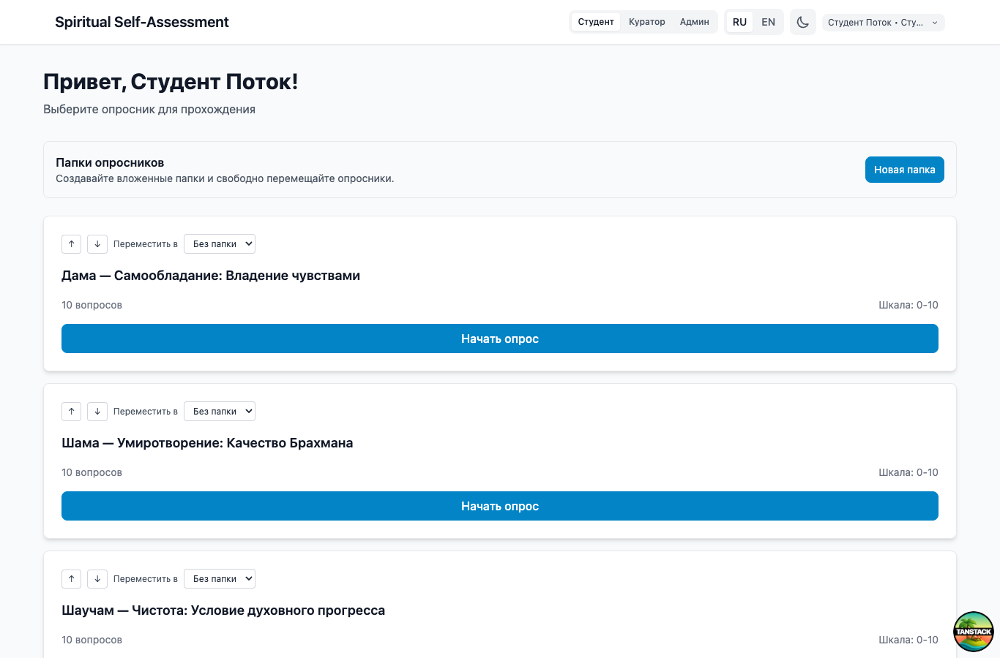 | 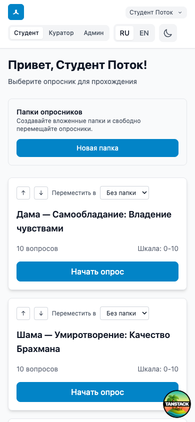

---

### 5. Прохождение вопроса (STU-05)

**Цель:** ответить на вопрос с соблюдением правил схемы.

**Шаги:**

1. Прочитайте формулировку вопроса и блок **Источники**.
2. Нажмите **Показать подсказки для самопроверки** — откроются критерии оценки.
3. Выберите оценку от **0 до 10** по шкале. При наведении/фокусе отображается описание оценки.
4. При необходимости добавьте **комментарий** в формате Markdown (панель инструментов для форматирования).
5. Для вопросов с обязательным комментарием (`requires_comment`) кнопка **Далее/Завершить** заблокирована до ввода текста.

**Важно:**
- Ответ сохраняется в текущую сессию автоматически.
- Markdown-изображения и форматирование сохраняются в ответе.

**Скриншоты:** 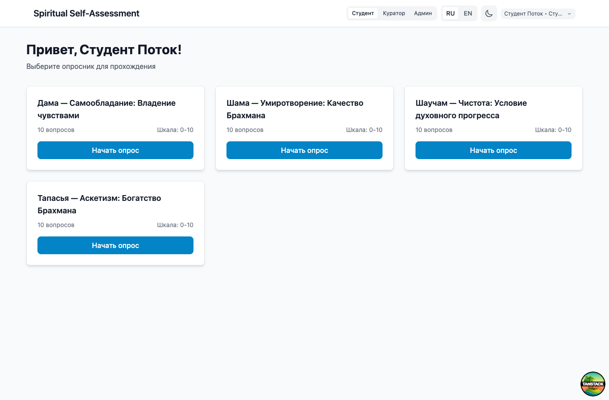 | 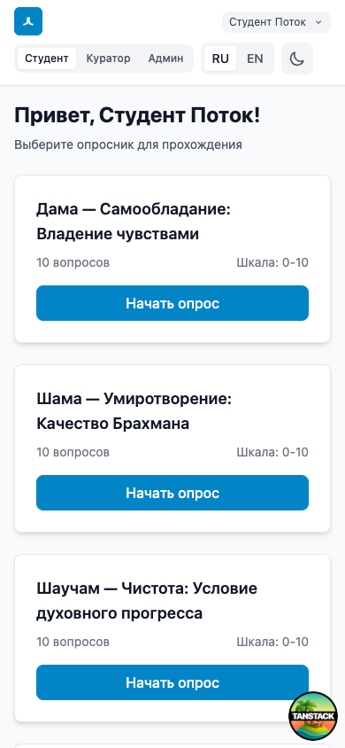

---

### 6. Пауза и продолжение (STU-06)

**Цель:** безопасно прервать и продолжить прохождение.

**Шаги:**

1. В опросе нажмите **Пауза**.
2. Вернитесь на список опросников.
3. Нажмите **Продолжить** в баннере приостановленного опроса или на карточке нужного опросника.

**Важно:**
- Пауза **не теряет прогресс** — сохраняется позиция вопроса и все ответы.
- Можно держать **несколько приостановленных сессий** одновременно.
- После перезагрузки страницы приостановленные сессии остаются доступными.

**Скриншот:** 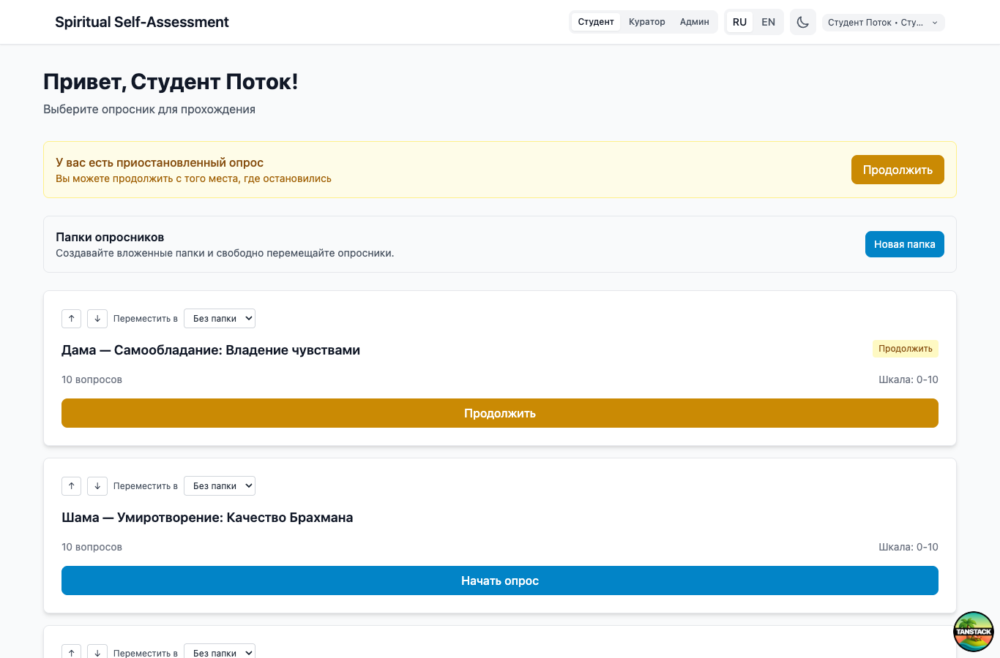

---

### 7. Завершение опроса и история (STU-07)

**Цель:** завершить попытку и увидеть её в результатах.

**Шаги:**

1. На последнем вопросе нажмите **Завершить**.
2. Перейдите в раздел **Мои результаты** (`/dashboard`).
3. Найдите новую попытку в группе соответствующего опросника.

**Важно:**
- Результат содержит дату, баллы и все ответы.
- Заголовки вопросов адаптивно обрезаются в одну строку на узких экранах.
- Если опросник был обновлён, отсутствующие в новой схеме вопросы маркируются.

**Скриншот:** 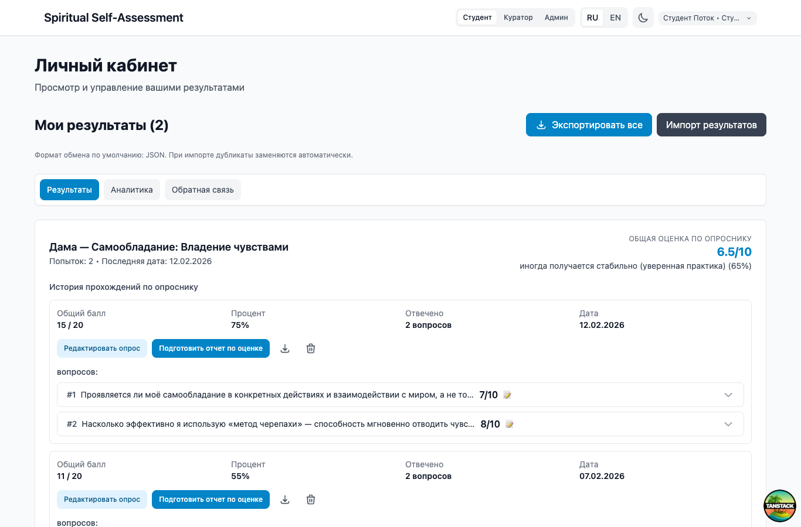

---

### 8. Экспорт результатов куратору (STU-08)

**Цель:** выгрузить результаты для проверки куратором.

**Шаги:**

1. Откройте `/dashboard`.
2. Нажмите **Экспортировать все** (JSON) для выгрузки всех попыток.
3. Либо экспортируйте отдельную попытку из карточки результата.

**Важно:**
- Экспорт включает комментарии и все данные ответов.
- Экспорт работает как для одной попытки, так и для всех попыток.

**Скриншоты:**  | 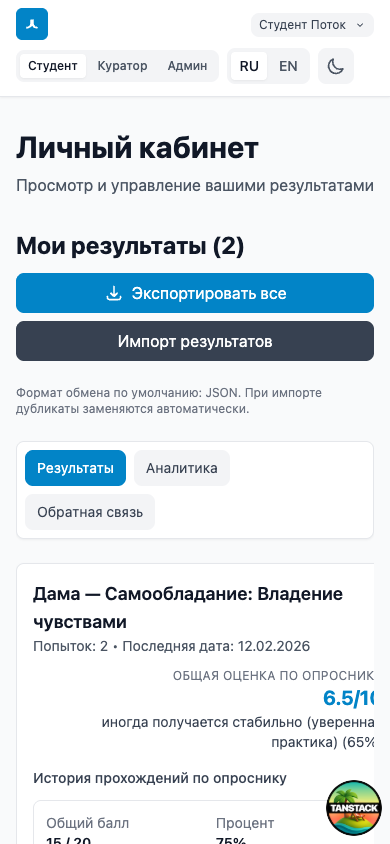

---

### 9. Импорт проверенных результатов и обратная связь (STU-09)

**Цель:** получить результаты после проверки куратором.

**Шаги:**

1. В `/dashboard` нажмите **Импорт результатов**.
2. Выберите JSON-файл, полученный от куратора.
3. Перейдите на вкладку **Обратная связь**.

**Важно:**
- Импорт работает с replace-стратегией дедупликации.
- Некорректный файл показывает читаемую ошибку без повреждения данных.
- Данные студента и куратора остаются изолированными.

**Скриншот:** 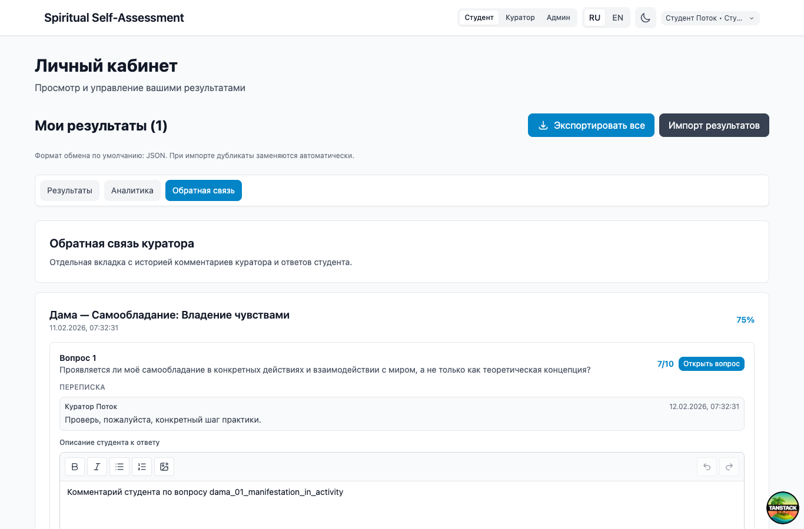

---

### 10. Доработка ответов после обратной связи (STU-10)

**Цель:** исправить ответ по замечаниям и подготовить повторную отправку.

**Шаги:**

1. Во вкладке **Обратная связь** откройте нужный вопрос кнопкой **Открыть вопрос**.
2. Система откроет режим редактирования соответствующей попытки.
3. Скорректируйте комментарий или оценку.
4. Завершите попытку заново и экспортируйте обновлённый результат.

**Важно:**
- Фокус возвращается к нужному вопросу.
- История обратной связи не теряется при редактировании.
- Повторный экспорт включает обновлённые ответы.

**Скриншот:** 

---

### 11. Статистика и аналитика (STU-11)

**Цель:** посмотреть динамику и самооценку.

**Шаги:**

1. В `/dashboard` откройте вкладку **Аналитика**.
2. Выберите опросник из списка.
3. Настройте период с помощью быстрых диапазонов или календаря.
4. Изучите графики распределения и динамики по вопросам.

**Важно:**
- Шкала оценок отображается полностью от 0 до 10 (без категорий low/medium/high).
- Динамика вопроса показывается только при наличии 2 и более оценок.
- Календарная навигация корректно фильтрует данные по выбранному периоду.

**Скриншот:** 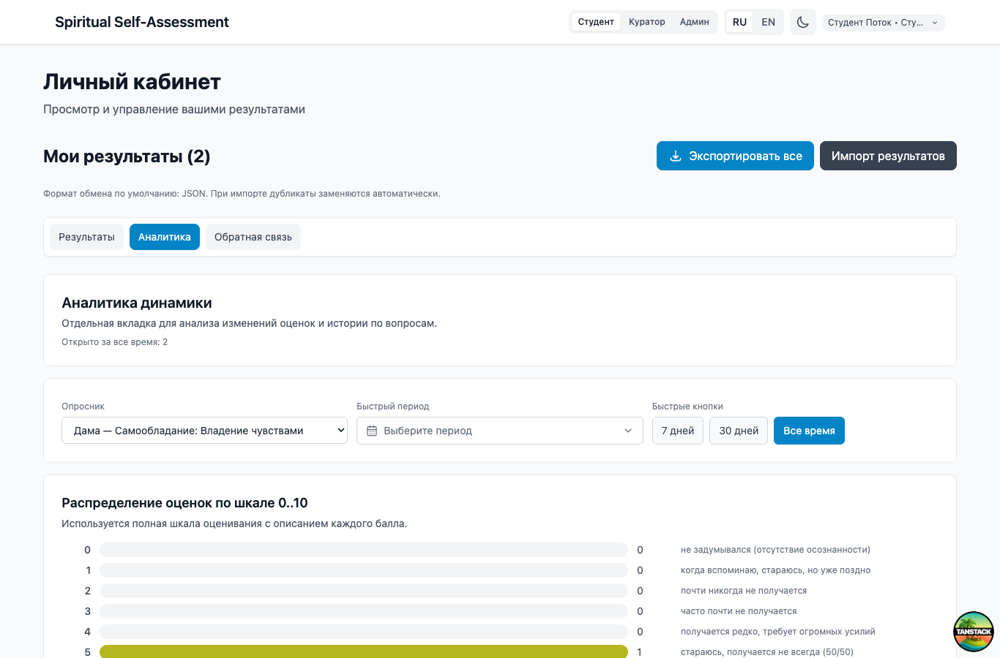

---

### 12. Подготовка документа для печати/PDF (STU-12)

**Цель:** сформировать читаемый отчёт по попытке.

**Шаги:**

1. В карточке попытки нажмите **Подготовить отчёт по оценке**.
2. Проверьте inline-превью отчёта.
3. Нажмите **Скачать** и выберите формат:
   - **PDF** — для печатного документа.
   - **Скачать текст** — Markdown с оформлением.
   - **Скачать текст без оформления** — чистый текст.
   - **HTML** — для просмотра в браузере.
4. Для печати нажмите **Печать**.

**Важно:**
- В отчёте нет технических идентификаторов и пустых блоков.
- Print и PDF формируются в светлой читаемой теме независимо от текущей темы приложения.

**Скриншот:** 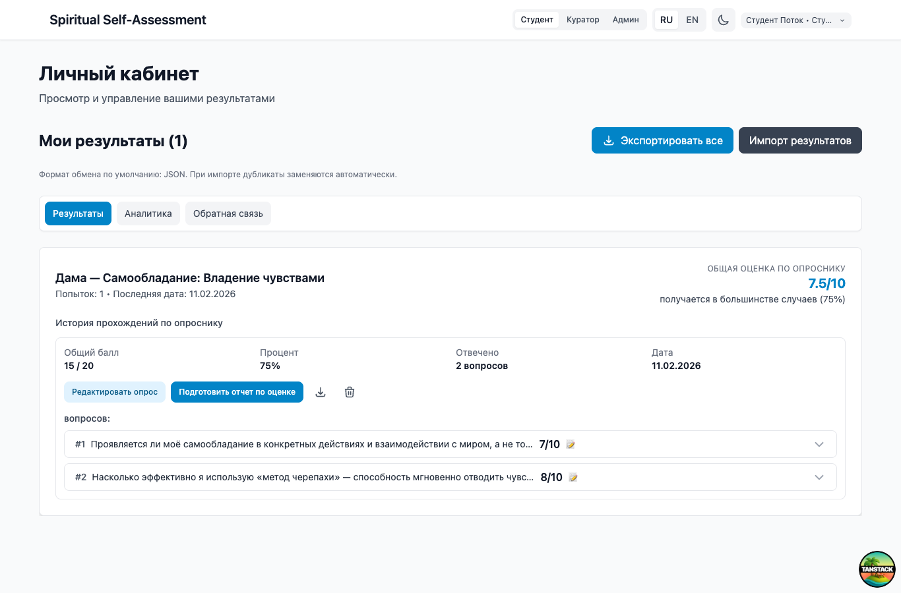

---

### 13. Сохранение профиля для переноса (STU-13)

**Цель:** безопасно завершить работу и перенести профиль на другое устройство.

**Шаги:**

1. Откройте `/profile`.
2. Нажмите **Выйти и сохранить файл профиля**.
3. Пройдите 2-шаговое подтверждение (подтверждение выхода + предупреждение о backup).
4. Сохраните скачанный backup JSON.

**Важно:**
- Backup-файл формируется **до** очистки сессии.
- После выхода можно восстановиться через файл или локальный архив (см. [STU-02](#2-восстановление-профиля-stu-02)).
- Если у пользователя есть данные куратора, они включаются в backup отдельным payload.

**Скриншоты:** 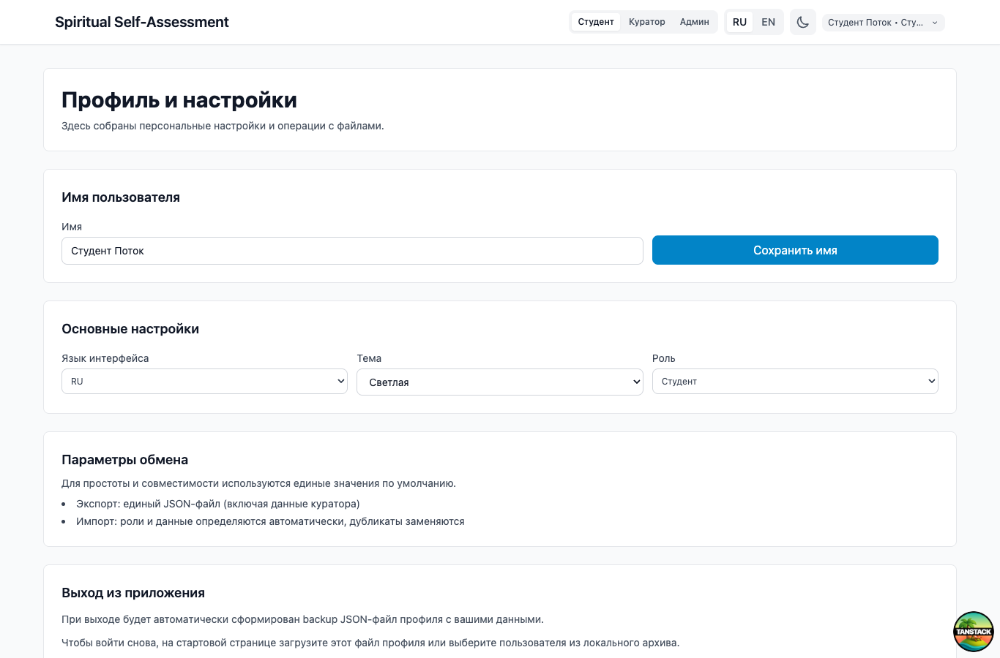 | 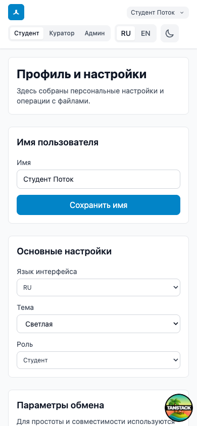

---

## Куратор

### 1. Переключение в режим куратора (CUR-01)

**Цель:** перейти в рабочее пространство куратора.

**Шаги:**

1. Переключите роль на **Куратор** через меню пользователя в шапке или на странице `/profile`.
2. Откройте `/dashboard` — отобразится **Панель куратора**.

**Важно:**
- Результаты студента текущего пользователя **не смешиваются** с данными куратора — используется отдельный curator scope.
- Метрики куратора (количество проверенных, ожидающих) отображаются на панели.

**Скриншоты:** 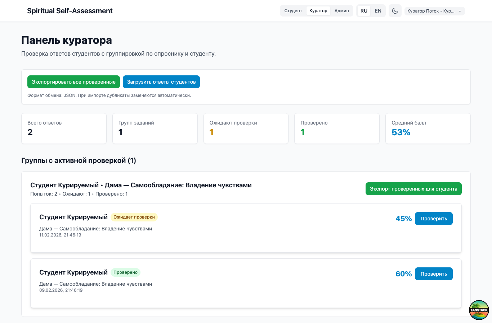 | 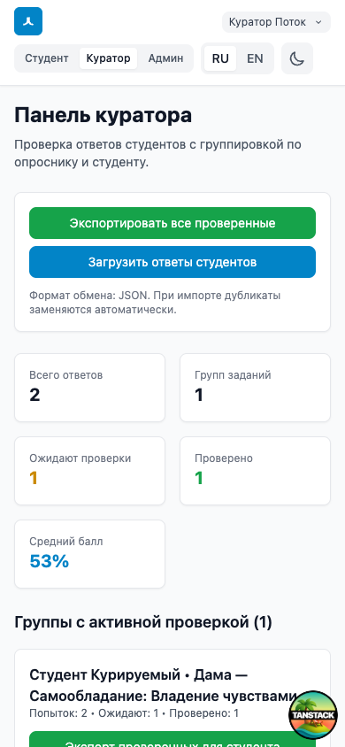

---

### 2. Загрузка ответов студентов (CUR-02)

**Цель:** импортировать файлы студентов для проверки.

**Шаги:**

1. В Панели куратора нажмите **Загрузить ответы студентов**.
2. Выберите JSON-файл, экспортированный студентом.

**Важно:**
- После импорта отображается summary: общее количество / импортировано / заменено / пропущено / невалидно.
- Некорректный файл не ломает UI и показывает читаемую ошибку.

**Скриншоты:**  | 

---

### 3. Проверка ответов и обратная связь (CUR-03)

**Цель:** провести review по вопросам и оставить комментарии.

**Шаги:**

1. Откройте активную группу (студент + опросник).
2. Нажмите **Проверить** у нужной попытки.
3. Для вопроса нажмите **+ Добавить обратную связь**.
4. Введите комментарий/вопрос и нажмите **Отправить**.

**Важно:**
- При открытии `pending` результата статус автоматически становится `in_review`.
- Несколько сообщений по одному вопросу сохраняются в тред.
- Markdown-контент обратной связи рендерится безопасно (XSS-защита).

**Скриншот:** 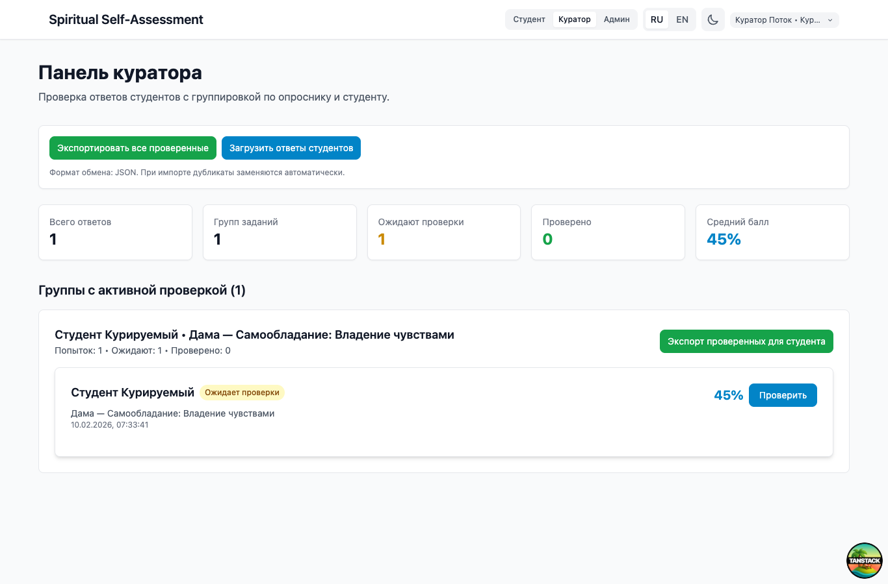

---

### 4. Статусы review и их значения (CUR-04)

**Цель:** управлять состоянием проверки.

| Статус | Значение |
|---|---|
| `pending` | Результат загружен и ещё не открыт куратором |
| `in_review` | Куратор начал проверку (открыт результат или добавлен feedback) |
| `reviewed` | Проверка завершена, результат готов к возврату студенту |
| `needs_revision` | Требуется доработка студентом |
| `approved` | Legacy alias; трактуется как `needs_revision` |

**Действия:**
- Нажмите **Отметить как проверено** для установки статуса `reviewed`.
- Нажмите **Отправить на доработку** для статуса `needs_revision`.

**Важно:**
- Переходы статусов мгновенно отражаются в счётчиках `pending`/`reviewed`.
- Экспорт студенту включает только `reviewed` и `needs_revision` результаты.

---

### 5. Экспорт результатов студенту (CUR-05)

**Цель:** передать проверенные материалы обратно студенту.

**Шаги:**

1. **По группе:** нажмите **Экспорт проверенных для студента** на конкретной группе.
2. **Общий:** нажмите **Экспортировать все проверенные** для всех групп.

**Важно:**
- При отсутствии проверенных результатов показывается предупреждение.
- Имя файла формируется с идентификаторами группы и временной меткой.

**Скриншот:** 

---

## Администратор

### 1. Переключение в режим админа (ADM-01)

**Цель:** открыть единый admin hub.

**Шаги:**

1. Переключите роль на **Админ**.
2. Откройте `/dashboard`.
3. Выберите нужную вкладку: **Обзор**, **Опросники**, **Переводы**, **Миграции и сверка**.

**Важно:**
- Роуты `/editor` и `/translations` доступны только для роли admin.
- Для не-admin показывается access denied.

**Скриншоты:** 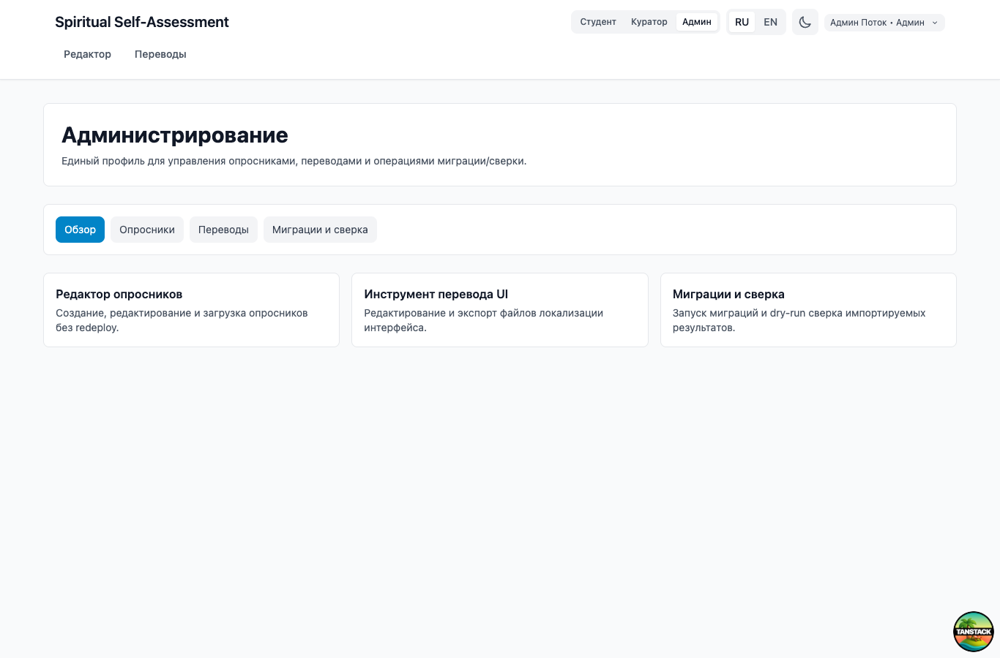 | 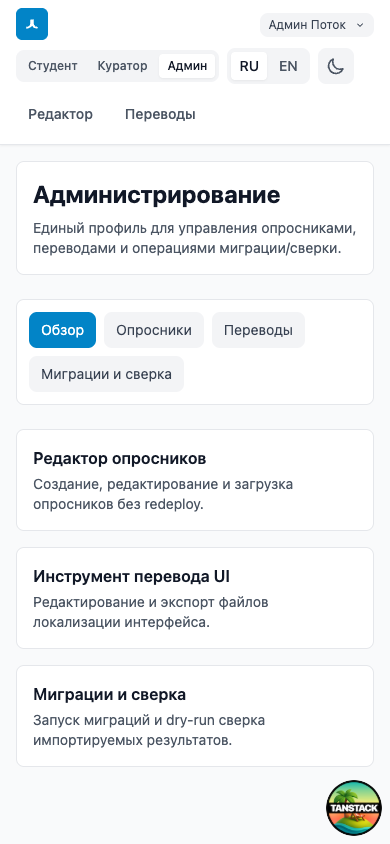

---

### 2. Редактирование локальных опросников (ADM-02)

**Цель:** создавать и поддерживать локальные опросники без redeploy.

**Шаги:**

1. Во вкладке **Опросники** загрузите существующий или импортируйте JSON.
2. Измените metadata, языки, вопросы, флаг `requires_comment`.
3. Нажмите **Сохранить в приложение**.
4. При необходимости используйте **Экспортировать файл** или **Удалить кастомный**.

**Важно:**
- Добавление языка создаёт поля перевода для всех вопросов.
- Валидация блокирует сохранение невалидной схемы с описанием ошибок.
- Локальный опросник сразу появляется в списке студента с бейджем **(локальный)**.

**Скриншот:** 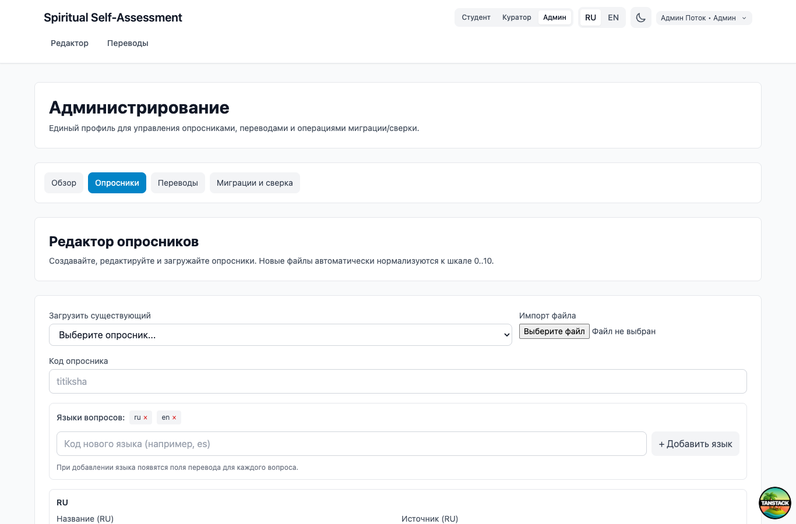

---

### 3. Редактирование и добавление переводов (ADM-03)

**Цель:** поддерживать и расширять UI-локализацию.

**Шаги:**

1. Во вкладке **Переводы** выберите язык.
2. Нажмите **Подгрузить текущие** для загрузки актуальных переводов или импортируйте файл.
3. Отредактируйте JSON в встроенном редакторе.
4. Нажмите **Скачать файл перевода**.
5. При необходимости экспортируйте все переводы или выполните **аудит покрытия** форм.

**Важно:**
- Ошибочный JSON валидируется и показывает ошибку.
- Audit-таблица показывает пробелы в переводах `ru`/`en`.
- Coverage report скачивается для анализа.

**Скриншот:** 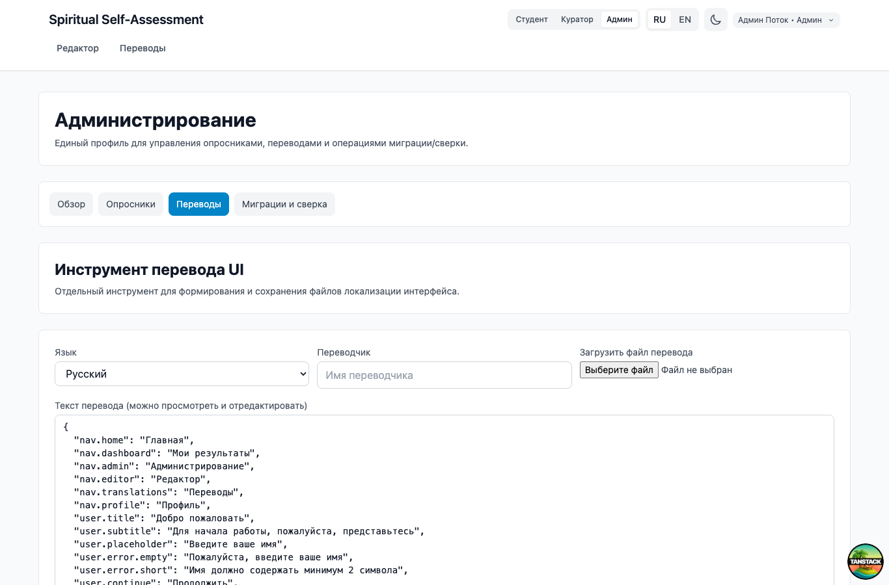

---

### 4. Операции миграции и сверки (ADM-04)

**Цель:** проверить совместимость данных до импорта и запустить миграции.

**Шаги:**

1. Во вкладке **Миграции и сверка** нажмите **Запустить миграции**.
2. Для dry-run сверки загрузите файл результатов в блок **Сверка импорта**.
3. Проанализируйте отчёт совместимости.

**Важно:**
- Reconciliation корректно считает `missingQuestionnaires` / `missingQuestions`.
- Ошибки не повреждают локальные данные — миграции безопасны.

**Скриншот:** 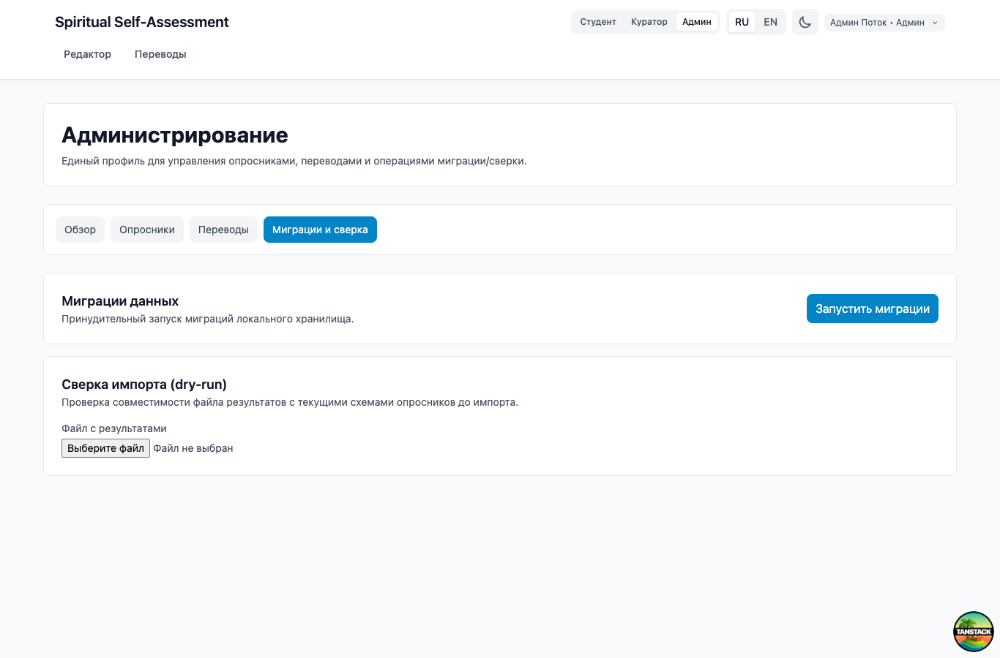

---

## Справочные материалы

### Типичный рабочий цикл студент-куратор

```
Студент                         Куратор
  │                                │
  ├─ Проходит опрос (STU-04..07)   │
  ├─ Экспорт результатов (STU-08)  │
  │         ──── JSON ────>        │
  │                                ├─ Импорт (CUR-02)
  │                                ├─ Проверка (CUR-03)
  │                                ├─ Обратная связь (CUR-03)
  │                                ├─ Статус (CUR-04)
  │                                ├─ Экспорт (CUR-05)
  │         <──── JSON ────        │
  ├─ Импорт (STU-09)               │
  ├─ Обратная связь (STU-09)       │
  ├─ Доработка (STU-10)            │
  └─ Повторный экспорт (STU-08)    │
```

### Обновление скриншотов

Для регенерации скриншотов при изменении UI:

```bash
# Полный набор flow-скриншотов (31 сценарий)
npm run test:ui:flow-scenarios

# Только определённые flow (фильтрация)
bash scripts/run-playwright-flow-scenarios.sh --flow-ids "STU-05,CUR-03"

# Обзорные скриншоты по ролям (6 штук)
npm run docs:user-manual:screenshots
```

Сценарные артефакты:
- **Скриншоты:** `docs/guides/assets/user-manual/*.png` (прямой вывод)
- **Отчёт:** `output/playwright/flow-scenarios/report.md`
- **JSON assert:** `output/playwright/flow-scenarios/assert.json`

### Канонические документы

| Документ | Назначение |
|---|---|
| `docs/testing/user-flow-baseline.md` | Канонический QA-бейзлайн потоков (Flow ID + регрессионные чекпоинты) |
| `docs/testing/scenarios/index.mjs` | Модульный scenario-pack для автоматической генерации скриншотов |
| `docs/guides/user-manual.md` | Этот документ — пользовательская инструкция |
